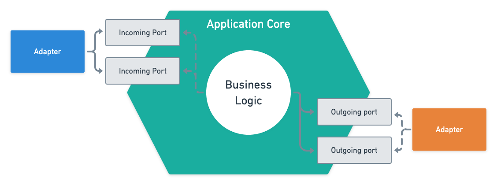
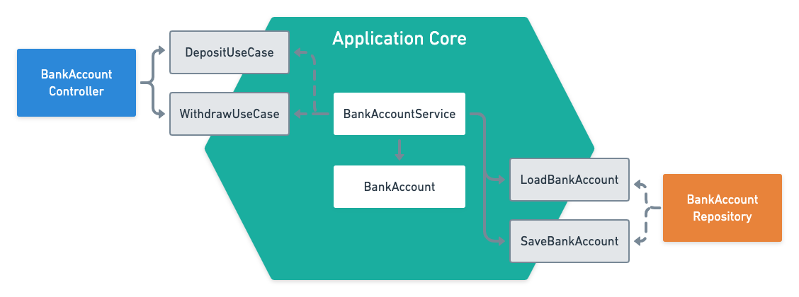
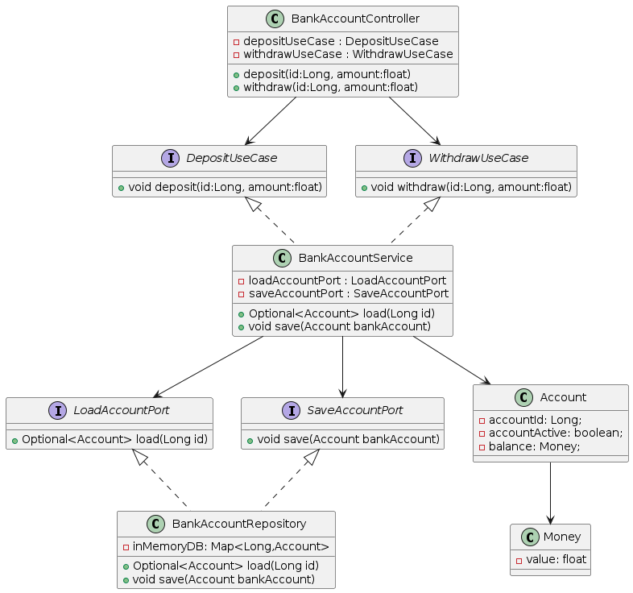

#Arquitetura Hexagonal
A arquitetura hexagonal é um estilo arquitetônico que se concentra em manter a lógica de negócios separada das preocupações externas .

O núcleo de negócios interage com outros componentes por meio de portas e adaptadores. Dessa forma, podemos mudar as tecnologias subjacentes sem ter que modificar o núcleo do aplicativo.

Logo abaixo segue o modelo proposto para essa POC levando em consideração o modelo lógico/estrutural apresentado na imagem acima.
 

Abaixo o diagrama de classes 

